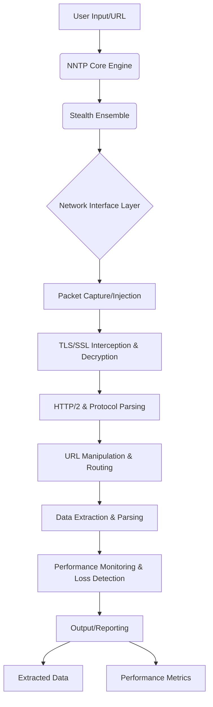

# Nexuss Network Transcendent Protocol (NNTP) - Architecture Design

## 1. Introduction

This document outlines the high-level architecture and core system modules for the Nexuss Network Transcendent Protocol (NNTP). NNTP is envisioned as a powerful, low-level network analysis and data fetching engine, implemented primarily in C++ and x86-64 assembly. Its primary goal is to provide unparalleled speed and control over network traffic, enabling the manipulation of URLs, zero-loss performance measurement, and efficient extraction of frontend data, even from authenticated or Cloudflare-protected resources.

## 2. Core Principles

*   **Network-Level Operation:** NNTP will operate at or below the transport layer, bypassing traditional application-level limitations.
*   **Extreme Performance:** Leveraging C++ and assembly for critical paths to achieve speeds faster than typical backend traffic processing.
*   **Zero-Loss Data Integrity:** Ensuring all fetched data is complete and accurate, with no packet loss or corruption.
*   **URL Agnostic Traversal:** Ability to handle and manipulate any URL, regardless of its complexity or underlying authentication mechanisms.
*   **Intelligent Data Extraction:** Identifying and extracting meaningful frontend data, such as video URLs, course lists, and other relevant content.
*   **Security and Stealth (Educational Purpose):** Designed for educational and research purposes to understand network behavior and data flow, with capabilities to transcend common network defenses like Cloudflare.

## 3. High-Level Architecture

NNTP will comprise several interconnected modules, each responsible for a specific aspect of network interaction and data processing. The architecture is designed for modularity, performance, and extensibility.

## 4. Core System Modules

### 4.1. NNTP Core Engine (C++/Assembly)

This is the heart of NNTP, orchestrating all operations. It will be responsible for:

*   **Session Management:** Handling multiple concurrent network sessions.
*   **Resource Allocation:** Efficiently managing memory and CPU resources.
*   **Concurrency Model:** Utilizing highly optimized threading or asynchronous I/O models for maximum throughput.
*   **Error Handling:** Robust error detection and recovery mechanisms.

### 4.2. Network Interface Layer (C++/Assembly)

Operating at the lowest possible level, this module will interact directly with network hardware.

*   **Raw Socket Interface:** Direct access to raw sockets for packet-level control.
*   **Packet Capture & Injection:** Utilizing libraries like `libpcap` (or custom assembly for direct NIC interaction) for capturing incoming packets and injecting outgoing packets.
*   **Network Stack Bypass:** Bypassing the operating system's conventional network stack for critical operations to reduce latency and overhead.

### 4.3. TLS/SSL Interception & Decryption (C++)

To access encrypted traffic, NNTP will implement mechanisms for TLS/SSL interception and decryption. This is crucial for manipulating URLs and extracting data from HTTPS connections.

*   **Man-in-the-Middle (MITM) Proxy:** Acting as a transparent proxy to intercept and decrypt TLS traffic. This requires careful handling of certificates for educational purposes.
*   **Custom TLS Stack (Optional/Advanced):** For extreme performance and control, a highly optimized, minimal TLS stack could be considered, though this is a significant undertaking.

### 4.4. HTTP/2 & Protocol Parsing (C++)

This module will be responsible for understanding and manipulating application-layer protocols.

*   **HTTP/1.1 and HTTP/2 Parsing:** Efficiently parsing and reconstructing HTTP requests and responses.
*   **Protocol Manipulation:** Modifying headers, payloads, and other protocol elements on the fly.
*   **Stateful Connection Tracking:** Maintaining the state of HTTP connections to handle complex interactions.

### 4.5. URL Manipulation & Routing (C++)

This module enables the core functionality of URL transcendence.

*   **Dynamic URL Rewriting:** Modifying URLs in real-time based on predefined rules or dynamic analysis.
*   **Request/Response Routing:** Directing traffic to different destinations or processing pipelines based on URL patterns.
*   **Authentication Bypass (Educational):** Techniques to understand and potentially bypass authentication mechanisms for educational purposes, without storing or misusing credentials.

### 4.6. Data Extraction & Parsing (C++)

This module focuses on intelligently extracting relevant information from the fetched data.

*   **Content-Type Analysis:** Identifying and handling various content types (HTML, JSON, XML, video streams).
*   **DOM/JSON Parsing:** Efficiently parsing HTML (e.g., using a lightweight DOM parser) and JSON structures to locate target data.
*   **Pattern Matching & Heuristics:** Employing regular expressions and heuristic algorithms to identify specific data patterns (e.g., YouTube URLs, course titles, video embeds).
*   **Video Stream Identification:** Detecting and extracting direct URLs for video content.

### 4.7. Performance Monitoring & Loss Detection (C++/Assembly)

Crucial for achieving 
zero-loss and superior performance.

*   **Packet-Level Latency Measurement:** Measuring round-trip times and processing delays at the packet level.
*   **Throughput Analysis:** Monitoring data transfer rates and identifying bottlenecks.
*   **Jitter and Loss Detection:** Implementing mechanisms to detect packet loss, retransmissions, and network jitter.
*   **Assembly-Optimized Counters:** Utilizing assembly language for high-precision timing and event counting to minimize overhead.

### 4.8. Stealth Ensemble (C++)

This advanced layer provides multi-dimensional stealth and obfuscation.

*   **Network Obfuscation:** Masking traffic patterns to avoid detection.
*   **Traffic Morphing:** Changing packet characteristics to bypass behavioral analysis.
*   **TCP Fingerprint Spoofing:** Mimicking standard browser stacks at the kernel level.

### 4.9. Output/Reporting (C++)

This module will present the extracted data and performance metrics in a user-friendly format.

*   **Structured Data Output:** Exporting extracted data in formats like JSON or CSV.
*   **Performance Dashboards:** Generating reports or logs detailing performance metrics, including latency, throughput, and loss rates.
*   **Real-time Logging:** Providing real-time feedback on network activity and data extraction progress.

## 5. Implementation Considerations

*   **Operating System Compatibility:** Initial focus on Linux due to its robust networking capabilities and direct hardware access.
*   **External Libraries:** Judicious use of highly optimized, low-level libraries (e.g., `libpcap` for packet capture, `OpenSSL` for TLS, `Boost.Asio` for asynchronous I/O).
*   **Assembly Integration:** Strategic use of x86-64 assembly for critical performance-sensitive sections, such as packet processing loops, timing, and cryptographic operations.
*   **Security Implications:** Emphasizing that the TLS/SSL interception and authentication bypass features are strictly for educational and research purposes, and must not be used for malicious activities.

## 6. Proof of Concept (Udacity URL)

The Udacity URL `https://learn.udacity.com/nd000-gc-251?version=2.0.1&partKey=2f4f583e-e3cc-4d56-bd1e-60178f1cf708&lessonKey=4300c2f6-0200-41f1-b23d-d3d29c41c847&conceptKey=6be97246-8bc0-4600-ad48-a5efb3b12e86` will serve as a primary proof-of-concept target. NNTP will demonstrate its ability to:

*   Traverse the authenticated learning platform.
*   Identify and extract real data, such as video URLs, course outlines, or lesson content.
*   Measure the performance of this extraction, aiming for zero loss and superior speed compared to standard tools.

## 7. Future Enhancements

*   **Cloudflare Transcendence:** Advanced techniques to bypass Cloudflare's protections at the network level.
*   **Distributed Architecture:** Scaling NNTP across multiple nodes for large-scale network analysis.
*   **AI/ML Integration:** Incorporating machine learning for intelligent traffic analysis, anomaly detection, and predictive data extraction.
*   **Cross-Platform Support:** Extending compatibility to other operating systems like Windows and macOS.

## 8. Conclusion

NNTP represents a significant endeavor in low-level network engineering, pushing the boundaries of what is possible in data fetching and network analysis. By combining the power of C++ and assembly with a deep understanding of network protocols, NNTP aims to provide an unparalleled tool for educational and research purposes in the realm of network transcendence.
